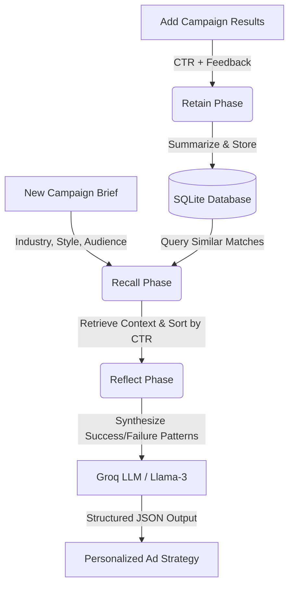

# CampaignMind

An AI-powered Ad Campaign Memory Agent that uses a persistent **Hindsight** memory substrate to continuously learn from advertising campaign performance. 

Instead of generating generic marketing recommendations, CampaignMind acts like a senior strategist who remembers every hook, creative style, audience segment, CTR result, and qualitative piece of feedback ever logged—becoming incrementally smarter with every single campaign.

---

## 🏗️ Hindsight Memory Architecture

CampaignMind manages agent memory through three core functions: **Retain**, **Recall**, and **Reflect**.



1. **Retain:** When campaign performance results are logged (e.g. CTR, watch time, feedback), the engine processes the parameters, summarizes the qualitative learnings, and creates a persistent memory node in the database.
2. **Recall:** When a user requests a new ad campaign, the engine queries the SQLite archive for historical campaigns sharing the same industry, creative style, or target audience.
3. **Reflect:** The retrieved memories are analyzed and grouped into winning vs. underperforming patterns. This synthesized insight is injected into the LLM system prompt, forcing it to generate a data-backed creative hook, creative style, and script.

---

## 🛠️ Tech Stack

### Frontend
- **Framework:** Next.js 15 (App Router, TypeScript)
- **Styling:** Tailwind CSS v4, custom glassmorphism design system
- **Charts:** Chart.js, React Chartjs 2 (Neon metrics visualizations)
- **Icons:** Lucide React
- **Auth:** Clerk SDK (safely wraps Clerk auth and falls back to a **Demo Workspace Mode** if keys are absent, ensuring out-of-the-box evaluation)

### Backend
- **Framework:** FastAPI (Python)
- **Server:** Uvicorn
- **Database:** SQLite (Relational structure mapping `campaigns`, `campaign_results`, and `memories`)
- **AI Integration:** Groq API (Llama-3-8B JSON Mode, with built-in rule-based strategic fallback if `GROQ_API_KEY` is not present)

---

## 🚀 Setup & Execution Instructions

### Prerequisites
- Python 3.10+
- Node.js 18+ and npm

---

### 1. Backend Setup

1. Open a terminal and navigate to the `backend/` directory:
   ```bash
   cd backend
   ```
2. Install dependencies:
   ```bash
   pip install -r requirements.txt
   ```
3. *(Optional)* Create a `.env` file in the `backend/` directory to configure the Groq API key:
   ```env
   GROQ_API_KEY=your_groq_api_key_here
   ```
   *Note: If no API key is provided, the backend automatically runs in **Simulator Mode**, executing the exact hindsight learning progression described in the judging demo.*
4. Start the FastAPI backend server:
   ```bash
   uvicorn main:app --reload
   ```
   The backend will start running on `http://127.0.0.1:8000`.

---

### 2. Frontend Setup

1. Open a new terminal and navigate to the `frontend/` directory:
   ```bash
   cd frontend
   ```
2. Install dependencies:
   ```bash
   npm install
   ```
3. *(Optional)* Create a `.env.local` file in the `frontend/` directory to configure Clerk auth:
   ```env
   NEXT_PUBLIC_CLERK_PUBLISHABLE_KEY=your_clerk_publishable_key
   CLERK_SECRET_KEY=your_clerk_secret_key
   ```
   *Note: If no keys are provided, the frontend automatically falls back to **Demo Workspace Mode**, giving you access to all features (Dashboard, Campaigns, Memory Substrate, AI Strategist, and Analytics) with a simulated profile.*
4. Start the Next.js development server:
   ```bash
   npm run dev
   ```
   Open `http://localhost:3000` in your browser.

---

## 🧪 Automated Testing

You can verify the entire Hindsight memory learning progression programmatically using the included backend test runner:
1. Open a terminal at the project root directory.
2. Run:
   ```bash
   python backend/test_memory_flow.py
   ```
3. The script will execute a 3-step learning simulation:
   - **Step 1:** Queries a skincare brief with cold memory (verify `Confidence: Low` + generic founder script output).
   - **Step 2:** Stores skincare UGC results (CTR 4.8%) -> queries skincare brief again (verify `Confidence: Medium` + UGC recommended).
   - **Step 3:** Stores underperforming founder videos (CTR 2.1%) and winning Before/After UGC (5.2%) -> queries skincare brief again (verify `Confidence: High` + Before/After UGC recommended, highlighting founder videos underperforming).

---

## 📊 API Endpoint Catalog

| Method | Endpoint | Description |
| :--- | :--- | :--- |
| **POST** | `/campaigns` | Initialize a new ad campaign brief |
| **GET** | `/campaigns` | Fetch all campaigns (with latest CTR performance) |
| **GET** | `/campaigns/{id}` | Fetch detailed campaign metadata, results, and memories |
| **POST** | `/campaigns/{id}/results` | Report CTR/watch-time results (Triggers Hindsight Retain) |
| **GET** | `/memories` | Retrieve the entire timeline of memory nodes |
| **POST** | `/generate-strategy` | Generate a strategy (Triggers Hindsight Recall + Reflect) |
| **GET** | `/analytics` | Retrieve summaries, CTR trends, and performance breakdown data |
